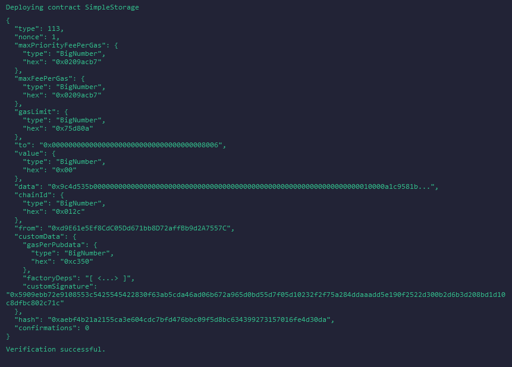
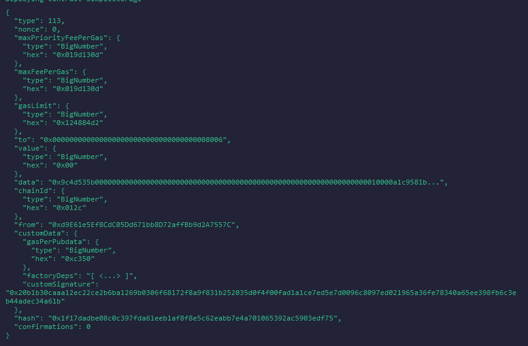

# Deployment Information

- The simple storage contract was developed on the web IDE Remix
- The contract was deployed to the L1 testnet Sepolia 
- The contract was then deployed to the L2 testnet zkSync Sepolia, where the contact had to be signed first, this is the output in the terminal for verified: 
- The contract was then deployed to the L2 testnet zkSync Sepolia, where the contact had to be signed first, this is the output in the terminal for non verified: 
- The address of the verified contract on the zkSync Sepolia testnet can be seen on Sepolia Explorer zkSync with the address:
0x9CF546be37A97593B03Ae9C43623A8d62b81805B
- The address of the unverified contract on the zkSync Sepolia testnet can be seen on Sepolia Explorer zkSync with the address:
0x9273E630574c77A2E530F1B467CE2b24936c554D
- The address of the contract on Sepolia can be seen on Sepolia Etherscan with the address: 
0xdC5F9AD68fad7239075f3D53763B99d4b5a55777

## Things to note
- The remix zkSync pluggin is tempermental, so it doesn't always work. Just try again another time
