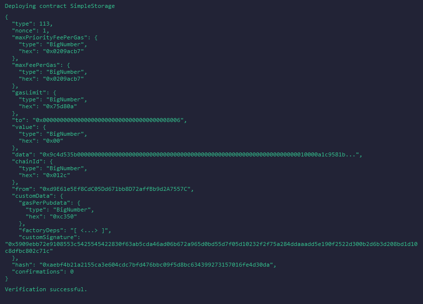
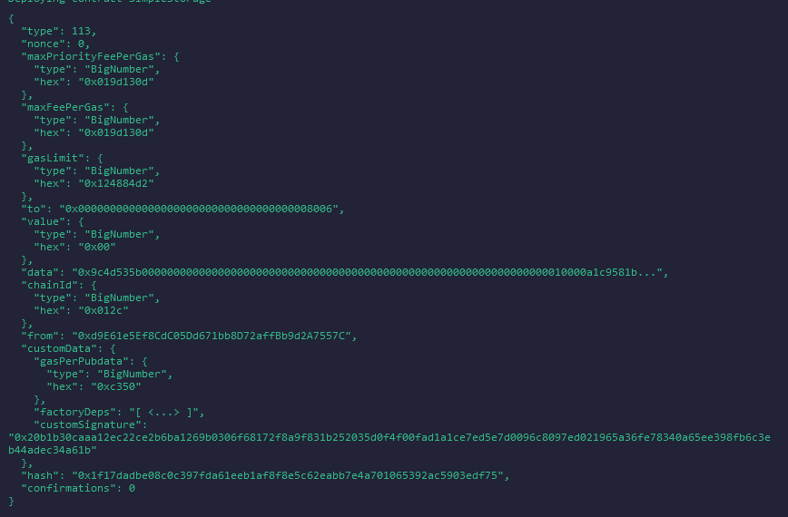

# Web3 Projects Repository

Welcome to the **Web3 Projects** repository. This repository contains a collection of projects and tutorials related to Web3 development, focusing on the creation and deployment of smart contracts using Solidity, as well as interaction with various blockchain networks, including Layer 1 (L1) and Layer 2 (L2) solutions.

## Table of Contents

- [Project Overview](#project-overview)
- [Simple Storage Contract](#simple-storage-contract)
  - [Contract Overview](#contract-overview)
  - [Deployment Information](#deployment-information)
  - [Verified vs. Unverified Deployments](#verified-vs-unverified-deployments)
  - [Step-by-Step Guide](#step-by-step-guide)
- [Storage Factory (Deploying multiple storage contracts)](#storage-factory)
- [Application Deployment Notes](#application-deployment-notes)
- [Additional Resources](#additional-resources)

## Project Overview

This repository is a collection of Web3 projects, primarily focused on the development and deployment of smart contracts using Solidity. The projects are structured to provide clear, step-by-step instructions on how to create and deploy contracts on different Ethereum testnets, including Sepolia and zkSync Sepolia.

## Simple Storage Contract

### Contract Overview

The Simple Storage contract is a basic example of a smart contract written in Solidity. It allows users to store and retrieve a favorite number, as well as associate this number with a name using a `mapping`.

#### Key Features:
- Store a favorite number.
- Retrieve the stored number.
- Associate a favorite number with a name.
- View all stored names and numbers.

#### Contract Code
```solidity
// SPDX-License-Identifier: MIT
pragma solidity ^0.8.26;

contract SimpleStorage {
    uint256 MyFavouriteNumber;

    struct Person {
        uint256 favouriteNumber;
        string name;
    }

    Person[] public listOfPeople;
    mapping(string => uint256) public nameToFavouriteNumber;

    function store(uint256 _favouriteNumber) public {
        MyFavouriteNumber = _favouriteNumber;
    }

    function retrieve() public view returns(uint256) {
        return MyFavouriteNumber;
    }

    function addPerson(string memory _name, uint256 _favouriteNumber) public {
        listOfPeople.push(Person(_favouriteNumber, _name));
        nameToFavouriteNumber[_name] = _favouriteNumber;
    }
}
```

### Deployment Information

This section provides details about the deployment process for the Simple Storage smart contract, including deployment environments, contract verification, and relevant addresses.

- **Development Environment**: The Simple Storage contract was developed using [Remix IDE](https://remix.ethereum.org/), a powerful online tool for writing, testing, and deploying Solidity contracts.
  
- **L1 Testnet Deployment (Sepolia)**:
  - The contract was first deployed on the Sepolia testnet, an Ethereum Layer 1 test environment.
  - **Contract Address on Sepolia**: [0xdC5F9AD68fad7239075f3D53763B99d4b5a55777](https://sepolia.etherscan.io/address/0xdC5F9AD68fad7239075f3D53763B99d4b5a55777)

- **L2 Testnet Deployment (zkSync Sepolia)**:
  - Following the deployment on Sepolia, the contract was also deployed on zkSync Sepolia, a Layer 2 scaling solution.
  - The deployment on zkSync Sepolia involved scenarios where the contract was either verified or not.

### Verified vs. Unverified Deployments

- **Verified Contract**:
  - The contract was successfully verified on zkSync Sepolia.
  - **Contract Address**: [0x9CF546be37A97593B03Ae9C43623A8d62b81805B](https://sepolia.explorer.zksync.io/address/0x9CF546be37A97593B03Ae9C43623A8d62b81805B)
  - 

- **Unverified Contract**:
  - The unverified contract was deployed.
  - **Contract Address**: [0x9273E630574c77A2E530F1B467CE2b24936c554D](https://sepolia.explorer.zksync.io/address/0x9273E630574c77A2E530F1B467CE2b24936c554D)
  - 

### Step-by-Step Guide

For those looking to replicate the deployment process, a detailed step-by-step guide is provided in the [StepByStepGuide.md](./SmartContractDeployment/StepByStepGuide.md). This guide covers everything from writing your Solidity code to deploying your smart contract on both L1 and L2 testnets.

## Storage Factory

## Application Deployment Notes

Additional details and notes on the deployment process can be found in the [deployment.md](./deployment.md) file. This includes information on language configurations and deployment scripts.

## Additional Resources

- [Remix IDE](https://remix.ethereum.org/)
- [zkSync Documentation](https://docs.zksync.io/)
- [Solidity Documentation](https://docs.soliditylang.org/)
- [Sepolia Etherscan](https://sepolia.etherscan.io/)
- [zkSync Sepolia Explorer](https://explorer.zksync.io/)
