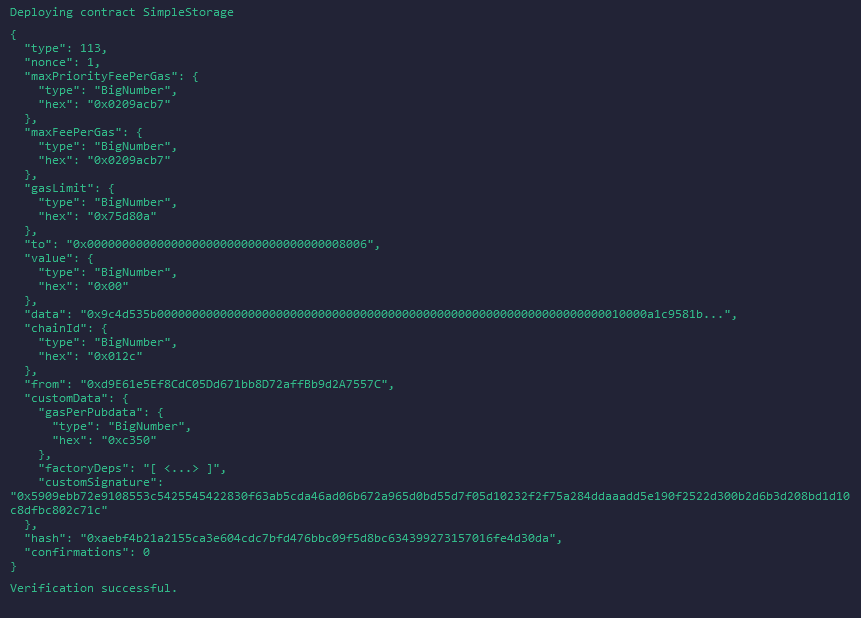
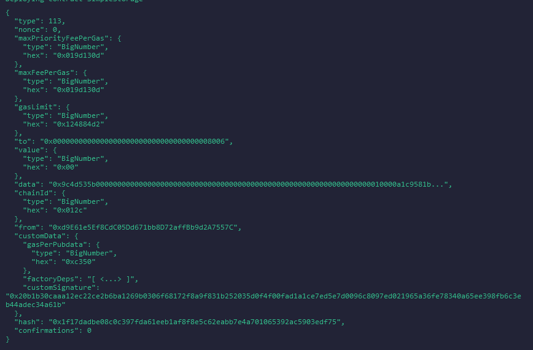

# Deployment Information

This section provides details about the deployment process for the Simple Storage smart contract, including deployment environments, contract verification, and relevant addresses.

## Contract Development and Deployment Overview

- **Development Environment**: The Simple Storage contract was developed using [Remix IDE](https://remix.ethereum.org/), a powerful online tool for writing, testing, and deploying Solidity contracts.
  
- **L1 Testnet Deployment (Sepolia)**:
  - The contract was first deployed on the Sepolia testnet, an Ethereum Layer 1 test environment. This deployment allowed for initial testing and interaction with the contract in a controlled, decentralized environment.
  - **Contract Address on Sepolia**: [0xdC5F9AD68fad7239075f3D53763B99d4b5a55777](https://sepolia.etherscan.io/address/0xdC5F9AD68fad7239075f3D53763B99d4b5a55777)

- **L2 Testnet Deployment (zkSync Sepolia)**:
  - Following successful deployment on Sepolia, the contract was also deployed on zkSync Sepolia, a Layer 2 scaling solution that offers faster and more cost-effective transactions.
  - The deployment on zkSync Sepolia involved two scenarios: one where the contract was verified and another where it was not.

### Deployment Details for zkSync Sepolia

1. **Verified Contract**:
   - The contract was successfully deployed and verified on zkSync Sepolia.
   - **Contract Verification**: Before the contract could be deployed, it had to be signed. The terminal output confirming the verification can be seen here: 
   
   - **Contract Address**: The verified contract is accessible on the zkSync Sepolia Explorer at the following address: [0x9CF546be37A97593B03Ae9C43623A8d62b81805B](https://sepolia.explorer.zksync.io/address/0x9CF546be37A97593B03Ae9C43623A8d62b81805B)

2. **Unverified Contract**:
   - An attempt was also made to deploy a non-verified version of the contract on zkSync Sepolia.
   - **Contract Output**: The terminal output for the unverified deployment (where the code is not visible) is shown here:
   
   - **Contract Address**: The unverified contract can be viewed on the zkSync Sepolia Explorer at the following address: [0x9273E630574c77A2E530F1B467CE2b24936c554D](https://sepolia.explorer.zksync.io/address/0x9273E630574c77A2E530F1B467CE2b24936c554D#transactions)

## Additional Notes

- **Plugin Stability**: It's important to note that the Remix zkSync plugin can be temperamental and may not always work as expected. If you encounter issues during deployment, it’s recommended to try again later or ensure your setup aligns with the latest compatibility guidelines for zkSync.